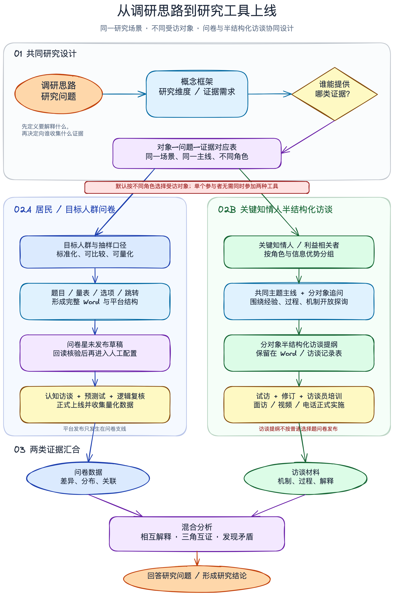
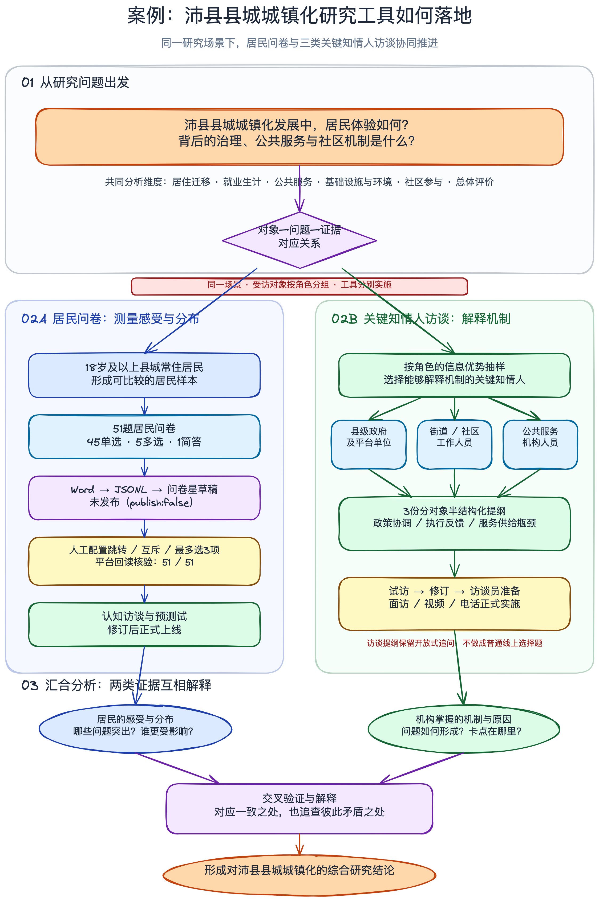

[中文](README.md) | [English](README_EN.md)

# mixed-methods-instrument-design

[](https://agentskills.io/specification)
[](LICENSE)
[](#默认产出)

一个面向经验研究的 Agent Skill：从同一套研究目的、研究问题和理论框架出发，协同设计彼此对齐的量化问卷与半结构化访谈提纲，并预先安排两类证据如何在分析阶段汇合。

它允许问卷与访谈面向相同或不同受访对象。默认交付是一份完整 Word；用户明确要求时，可把审核通过的问卷准备为问卷星未发布草稿。



## 解决什么问题

很多研究工具看上去同时拥有“问卷”和“访谈”，实际上只是把两组题目放在一起：

- 访谈里混入大量机械评分题，既打断对话，也得不到可靠测量；
- 问卷与访谈没有共同的研究问题和构念映射；
- 默认两类工具必须发给同一批人；
- 两类资料分别分析，写报告时才临时寻找对应关系；
- 新编或改写题项继承了并不存在的信效度声明；
- 为了推送平台，跳转、拒答、随机化或缺失值规则被静默删掉。

本 Skill 先建立中央映射，再分别运行完整的问卷与访谈方法管线，最后生成联合展示和整合计划。两条管线可以面向不同人群，但必须共同服务上位研究问题。

## 核心原则

1. **先研究设计，后写题。** 先确认 RQ、构念、样本关系、时序、权重和整合点。
2. **双轨完整。** 问卷遵循测量、总调查误差、认知测试和验证逻辑；访谈保留 IPR、追问层级、可信度与反身性。
3. **不默认同一受访者。** 同一场景可以由居民提供体验数据，由政府、社区或服务机构解释过程与机制。
4. **先建映射，后做整合。** 每个 MIXED RQ 都必须同时获得两类证据，并声明比较、解释、开发、连接或三角互证方式。
5. **验证诚实。** 新题、译题和实质改写题只能标为待验证，不虚构信度、效度、饱和或代表性。
6. **上线受控。** 问卷星首次创建只能是未发布草稿；正式发布需要针对具体问卷 ID 再次确认。

## 适用范围

| 适合使用 | 不适合使用 |
|---|---|
| 同一研究需要问卷和访谈协同设计 | 只需要单一访谈提纲 |
| 不同人群分别提供量化与质性证据 | 只需要单一问卷 |
| 并行汇聚、解释型序贯、探索型序贯、嵌入式或多阶段设计 | 把现成问卷机械改成网页 |
| 需要中央映射、联合展示和预测试方案 | 访谈转写、正式统计分析或编码 |
| 需要生成一份完整的研究工具 Word | 没有研究问题，只想拼接两套题目 |
| 审核后需要创建问卷星未发布草稿 | 未经审核直接上线收数 |

## 支持的混合方法设计

| 设计 | 典型用途 | 工具关系 |
|---|---|---|
| 并行汇聚式（convergent） | 同期获得分布与机制证据 | 分别收集、分别分析、汇合解释 |
| 解释型序贯（QUAN → qual） | 解释异常值、组间差异或未解释模式 | 量化结果决定后续访谈抽样与追问 |
| 探索型序贯（QUAL → quan） | 从经验语言和主题开发问卷 | 访谈结果为问卷构念和题项提供输入 |
| 嵌入式（embedded） | 一条方法为主，另一条补充过程证据 | 次要管线嵌入特定阶段 |
| 多阶段（multiphase） | 多轮开发、连接与验证 | 每阶段单独声明输入、输出和整合点 |

如果研究逻辑要求序贯设计，Skill 不会把尚未取得的实证结果伪装成后续工具定稿，只会生成阶段化预案或占位框架。

## 工作流

1. 确认研究目的、RQ、理论框架、边界、人群和伦理要求。
2. 判定混合方法设计、时序、权重、样本关系和整合点。
3. 建立 RQ—构念/主题—人群—资料来源中央映射矩阵。
4. 检索并核查量表、正式调查工具、访谈 protocol 和方法来源。
5. 完整设计问卷：总体与抽样框、题项、选项、编码、跳转、缺失、计分、认知测试和 pilot。
6. 完整设计访谈：研究者版、现场详版、现场简版，以及主问题、追问、探测和可信度方案。
7. 生成联合展示，预设确认、扩展与不一致三类结果关系。
8. 运行机器校验与人工质量闸门，生成一份完整 Word。
9. 用户明确要求时，准备问卷星未发布草稿并回读核验。

## 默认产出

| 产出 | 内容 |
|---|---|
| 混合方法设计判定 | 设计类型、混合理由、时序、权重、样本关系、分析单位、整合点 |
| 中央映射矩阵 | RQ、构念/主题、人群、问卷变量、访谈功能、其他证据、整合策略 |
| 完整问卷包 | 研究者设计版、受访者实施版、变量字典、来源状态、逻辑与预测试方案 |
| 完整访谈包 | 研究者版、现场详版、现场简版、可信度、伦理、反身性与验证清单 |
| 整合包 | 空白联合展示、数据连接键、确认/扩展/不一致判断、元推论边界 |
| 实施前清单 | 抽样、伦理、专家评审、认知访谈、可用性测试、pilot、试访和数据管理 |
| 用户成品 | 默认一份包含全部问卷与分对象访谈提纲的完整 DOCX |
| 可选平台产出 | 每个 questionnaire form 对应一份问卷星未发布草稿 |

中央映射、JSON 规格、变量字典、校验记录和平台 manifest 默认作为内部工作材料保留，避免把使用者淹没在无效附件中。

## 案例：同一场景下的不同受访对象

下面的沛县县城城镇化案例只用于展示流程，不会被固化为 Skill 的默认主题。



案例中：

- 居民问卷测量居住、就业、公共服务、环境、社区参与和总体评价；
- 县级政府及平台单位、街道/社区工作人员、公共服务机构分别接受半结构化访谈；
- 问卷回答“哪些问题更突出、影响哪些人”，访谈解释“问题如何形成、机制卡在哪里”；
- 两类资料在研究问题和共同维度层汇合，不把不同人的数据强行合并成个人层总分。

## 安装

本仓库遵循开放的 [Agent Skills 规范](https://agentskills.io/specification)。推荐使用跨客户端的 `.agents/skills/` 目录。

### 项目级安装

```bash
mkdir -p .agents/skills
git clone https://github.com/Lambenthan/mixed-methods-instrument-design.git \
  .agents/skills/mixed-methods-instrument-design
```

### 用户级安装

```bash
mkdir -p ~/.agents/skills
git clone https://github.com/Lambenthan/mixed-methods-instrument-design.git \
  ~/.agents/skills/mixed-methods-instrument-design
```

核心 Skill 只需要兼容 Agent Skills 的客户端。可选功能需要：

- Python 3：运行结构校验和问卷星载荷准备脚本；
- Node.js 与 `docx`：生成完整 Word；
- Node.js 20+、问卷星官方 `wjx-cli` 和相应账号权限：创建在线草稿。

## 使用示例

### 同步设计问卷与访谈

```text
请使用 mixed-methods-instrument-design，围绕我的研究目的和研究问题，
同步设计一份目标人群问卷，以及面向关键知情人的半结构化访谈提纲。
量化和质性对象可以不同。先判断混合方法设计并建立中央映射，
默认交付一份完整 Word。
```

### 指定不同受访对象

```text
围绕同一个社区治理研究场景，为居民设计问卷，
为街道、社区工作人员和公共服务机构分别设计半结构化访谈提纲。
不要默认是同一批受访者；请说明每类人群提供什么证据，以及最终如何整合。
```

### 准备问卷星草稿

```text
在我审核并确认问卷规格后，为每个 questionnaire form
准备问卷星未发布草稿。不得直接发布；先回读并报告需要人工配置的逻辑。
```

## 本地校验

```bash
python3 scripts/validate_alignment.py assets/instrument-map.template.json
python3 scripts/check_interview_parity.py
python3 scripts/prepare_wjx_payload.py --help
node --check assets/mixed-instruments-docx-template.js
```

生成正式工具时，还应运行内置问卷子包的规格校验：

```bash
python3 references/questionnaire-design/scripts/validate_questionnaire_spec.py \
  path/to/questionnaire-spec.json
```

机器校验只能发现结构、映射、来源状态和验证声明中的问题，不能代替文献核查、伦理审查、认知访谈、专家评审或 pilot。

## 问卷星安全边界

在线流程固定为：

```text
本地设计 → 本地校验 → Word 人工审核 → 未发布草稿
→ 在线逐路径核对 → 用户确认具体问卷 ID → 正式发布
```

- API Key 只能放在环境变量、系统密钥管理或用户级 CLI 配置中；
- 不得把密钥写入 Skill、Word、JSONL、manifest、日志或聊天回复；
- 无法无损转换的跳转、随机化、拒答或验证规则必须阻断自动推送；
- 半结构化访谈提纲保留在 Word 中，不转换成普通线上选择题问卷；
- 正式发布、暂停、删除和清空答卷属于独立操作，需要单独确认。

问卷星集成基于官方 [wjx-ai-kit](https://github.com/wjxcom/wjx-ai-kit) 与 `wjx-cli`。

## 目录结构

```text
mixed-methods-instrument-design/
├── SKILL.md
├── README.md
├── README_EN.md
├── LICENSE
├── agents/
│   └── openai.yaml
├── assets/
│   ├── instrument-map.template.json
│   ├── interview-guide.template.json
│   ├── mixed-instruments-docx-template.js
│   ├── 研究工具_问卷与访谈提纲_完整模板.docx
│   └── diagrams/
├── references/
│   ├── questionnaire-design/
│   ├── interview-guide-design/
│   ├── mixed-methods-design.md
│   ├── integration-and-joint-display.md
│   ├── quality-gates.md
│   ├── output-contract.md
│   └── wenjuanxing-publishing.md
└── scripts/
    ├── validate_alignment.py
    ├── prepare_wjx_payload.py
    └── check_interview_parity.py
```

原 `interview-guide-design` 的方法基线完整内置在 `references/interview-guide-design/`。如果本仓库旁边存在原 Skill，一致性脚本会逐文件比较两者；维护者可增加 `--require-original` 将缺少原 Skill 视为错误。

## 方法边界

本 Skill 设计数据收集工具与整合计划，不替代：

- 抽样实施和代表性论证；
- 伦理审查、知情同意和数据治理；
- 成熟量表的授权、翻译和正式验证；
- 认知访谈、可用性测试、预测试和试访；
- 正式统计分析、质性编码和研究结论；
- 饱和、信度、效度或成员核验的实证判断。

方法来源、适用标准和检索纪律见 [authoritative-sources.md](references/authoritative-sources.md)。

## 参与贡献

欢迎提交 Issue 或 Pull Request。修改问卷或访谈方法基线时，请同时提供权威来源，并运行结构校验与访谈基线一致性检查。请勿提交 API Key、可识别答卷、访谈原始材料或未经授权的量表全文。

## License

[MIT](LICENSE)
