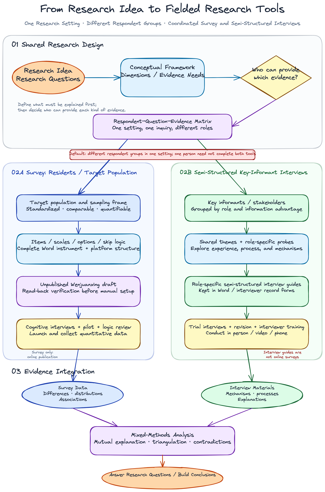
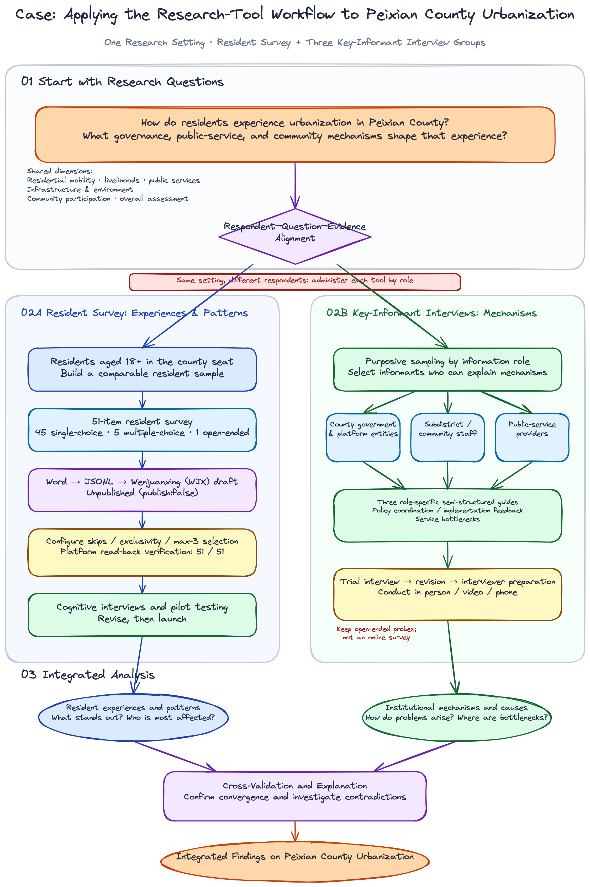

[中文](README.md) | [English](README_EN.md)

# mixed-methods-instrument-design

[](https://agentskills.io/specification)
[](LICENSE)
[](#default-outputs)

An Agent Skill for empirical research that co-designs an aligned quantitative survey and semi-structured interview guides from the same research purpose, research questions, and conceptual framework. It also plans how the two strands will be integrated during analysis.

The survey and interviews may involve the same or different respondent groups. The default user-facing deliverable is one complete Word document. When explicitly requested, a validated survey can also be prepared as an unpublished Wenjuanxing draft.



## The problem it addresses

Many projects contain both a “survey” and an “interview guide” without having a genuine mixed-methods design:

- interviews are interrupted by mechanical rating questions that provide neither depth nor sound measurement;
- survey items and interview questions are not mapped to shared research questions or constructs;
- both strands are assumed to require the same respondents;
- integration is postponed until report writing;
- new or adapted items inherit validity claims they have not earned;
- platform conversion silently drops skip logic, refusal options, randomization, or validation rules.

This Skill builds a central alignment matrix first, runs full survey and interview design pipelines separately, and then creates a joint display and integration plan. Different populations may contribute different kinds of evidence while still serving the same higher-level inquiry.

## Core principles

1. **Research design before item writing.** Establish RQs, constructs, sample relationships, timing, priority, and integration points first.
2. **Two complete methodological strands.** The survey follows measurement, total survey error, cognitive testing, and validation logic; the interview strand retains IPR, probing, trustworthiness, and reflexivity.
3. **No same-respondent assumption.** Residents may report experiences while government, community, or service-provider informants explain processes and mechanisms.
4. **Alignment before integration.** Every MIXED RQ must have evidence from both strands and an explicit compare, explain, build, connect, embed, or triangulate link.
5. **Honest validation claims.** New, translated, or materially adapted items remain unvalidated until evidence is collected.
6. **Controlled online publishing.** The first Wenjuanxing creation is always an unpublished draft; publication requires a separate confirmation for a specific survey ID.

## When to use it

| Use this Skill when | Use another workflow when |
|---|---|
| One study needs an aligned survey and interview guides | You only need a single interview guide |
| Quantitative and qualitative evidence comes from different groups | You only need a single survey |
| The design is convergent, sequential, embedded, or multiphase | You only need to turn an existing form into a webpage |
| You need a central matrix, joint display, and pilot plan | You need transcription, formal analysis, or coding |
| You want one complete research-instrument Word file | You have no research questions and only want two sets of items |
| A reviewed survey should become an unpublished WJX draft | You want to publish an unreviewed survey immediately |

## Supported mixed-methods designs

| Design | Typical purpose | Instrument relationship |
|---|---|---|
| Convergent | Collect distributional and mechanistic evidence in parallel | Collect and analyze separately, then integrate |
| Explanatory sequential (QUAN → qual) | Explain outliers, group differences, or unexplained patterns | Quantitative results guide interview sampling and probes |
| Exploratory sequential (QUAL → quan) | Develop constructs and items from participant language and themes | Interview findings inform survey development |
| Embedded | Add contextual or process evidence to a dominant strand | A secondary strand is embedded at a defined stage |
| Multiphase | Connect development and validation across several rounds | Each phase declares its inputs, outputs, and integration point |

When the research logic requires a sequential design, the Skill does not present a later instrument as final before the necessary empirical input exists. It produces a staged plan or placeholder framework instead.

## Workflow

1. Confirm the study purpose, RQs, conceptual framework, boundaries, populations, and ethical requirements.
2. Select and justify the mixed-methods design, timing, priority, sample relationship, and integration points.
3. Build an RQ–construct/theme–population–evidence alignment matrix.
4. Search for and verify scales, official survey instruments, interview protocols, and methodological sources.
5. Design the complete survey strand: target population, sampling frame, items, response options, coding, routing, missingness, scoring, cognitive interviews, and pilot testing.
6. Design the complete interview strand: researcher version, detailed field version, concise field version, main questions, follow-ups, probes, and trustworthiness procedures.
7. Generate a joint display and anticipate confirmation, expansion, and discordance.
8. Run machine validation and human quality gates, then generate one complete Word document.
9. If explicitly requested, prepare unpublished Wenjuanxing drafts and verify them by reading the online version back.

## Default outputs

| Output | Contents |
|---|---|
| Design determination | Design type, mixing rationale, timing, priority, sample relationship, unit of analysis, integration points |
| Central alignment matrix | RQs, constructs/themes, populations, survey variables, interview functions, other evidence, integration strategies |
| Complete survey package | Researcher specification, participant form, variable dictionary, source status, logic, and pretesting plan |
| Complete interview package | Researcher, detailed field, and concise field versions; trustworthiness, ethics, reflexivity, and validation plan |
| Integration package | Blank joint display, linking keys, confirmation/expansion/discordance rules, meta-inference boundaries |
| Pre-fieldwork checklist | Sampling, ethics, expert review, cognitive interviews, usability testing, pilot, trial interviews, data management |
| User-facing deliverable | One DOCX containing all survey forms and role-specific interview guides |
| Optional platform output | One unpublished Wenjuanxing draft per questionnaire form |

The central matrix, JSON specifications, variable dictionary, validation reports, and platform manifest are retained as internal working materials by default.

## Case example: different respondents in one setting

The Peixian County urbanization case below demonstrates the workflow. It is an example, not a built-in topic or default template.



In the example:

- a resident survey measures housing, livelihoods, public services, environment, community participation, and overall assessment;
- county government and platform entities, subdistrict/community staff, and public-service providers receive separate semi-structured interview guides;
- the survey identifies which problems stand out and who is most affected;
- interviews explain how the problems arise and where institutional bottlenecks occur;
- the strands are integrated at the research-question and shared-dimension level without forcing different individuals’ data into a person-level score.

## Installation

This repository follows the open [Agent Skills specification](https://agentskills.io/specification). The cross-client `.agents/skills/` location is recommended.

### Project-level installation

```bash
mkdir -p .agents/skills
git clone https://github.com/Lambenthan/mixed-methods-instrument-design.git \
  .agents/skills/mixed-methods-instrument-design
```

### User-level installation

```bash
mkdir -p ~/.agents/skills
git clone https://github.com/Lambenthan/mixed-methods-instrument-design.git \
  ~/.agents/skills/mixed-methods-instrument-design
```

The core Skill only requires an Agent Skills-compatible client. Optional capabilities require:

- Python 3 for structural validation and Wenjuanxing payload preparation;
- Node.js and `docx` for complete Word generation;
- Node.js 20+, the official Wenjuanxing `wjx-cli`, and eligible account access for online drafts.

## Usage examples

### Co-design a survey and interview guides

```text
Use mixed-methods-instrument-design to create an aligned survey for the target
population and semi-structured interview guides for key informants. The
quantitative and qualitative populations may differ. Determine the mixed-methods
design and build the central alignment matrix first. Deliver one complete Word file.
```

### Assign different respondent groups

```text
For one community-governance setting, design a resident survey and separate
semi-structured interview guides for subdistrict officials, community staff,
and public-service providers. Do not assume they are the same respondents.
Explain what evidence each group contributes and how the evidence will be integrated.
```

### Prepare unpublished Wenjuanxing drafts

```text
After I review and approve the survey specification, prepare one unpublished
Wenjuanxing draft for each questionnaire form. Do not publish. Read each draft
back and report any logic that still requires manual configuration.
```

## Local validation

```bash
python3 scripts/validate_alignment.py assets/instrument-map.template.json
python3 scripts/check_interview_parity.py
python3 scripts/prepare_wjx_payload.py --help
node --check assets/mixed-instruments-docx-template.js
```

When producing a real instrument, also validate the complete questionnaire specification:

```bash
python3 references/questionnaire-design/scripts/validate_questionnaire_spec.py \
  path/to/questionnaire-spec.json
```

Machine checks can detect structural, alignment, provenance-status, and validation-claim problems. They cannot replace literature verification, ethical review, cognitive interviews, expert review, or pilot testing.

## Wenjuanxing safety boundary

The online state machine is fixed:

```text
Local design → local validation → human Word review → unpublished draft
→ online path testing → explicit confirmation of a survey ID → publication
```

- API keys belong only in environment variables, operating-system secret storage, or user-level CLI configuration.
- Keys must never appear in the Skill, Word files, JSONL, manifests, logs, or chat responses.
- Skip logic, randomization, refusal options, or validation rules that cannot be mapped faithfully must block automatic draft creation.
- Semi-structured interview guides remain in Word and are not converted into ordinary online multiple-choice surveys.
- Publication, suspension, deletion, and response clearing are separate actions that require separate authorization.

The integration uses the official Wenjuanxing [wjx-ai-kit](https://github.com/wjxcom/wjx-ai-kit) and `wjx-cli`.

## Repository structure

```text
mixed-methods-instrument-design/
├── SKILL.md
├── README.md
├── README_EN.md
├── LICENSE
├── agents/
│   └── openai.yaml
├── assets/
│   ├── instrument-map.template.json
│   ├── interview-guide.template.json
│   ├── mixed-instruments-docx-template.js
│   ├── 研究工具_问卷与访谈提纲_完整模板.docx
│   └── diagrams/
├── references/
│   ├── questionnaire-design/
│   ├── interview-guide-design/
│   ├── mixed-methods-design.md
│   ├── integration-and-joint-display.md
│   ├── quality-gates.md
│   ├── output-contract.md
│   └── wenjuanxing-publishing.md
└── scripts/
    ├── validate_alignment.py
    ├── prepare_wjx_payload.py
    └── check_interview_parity.py
```

The original `interview-guide-design` methodological baseline is bundled in full under `references/interview-guide-design/`. When the standalone Skill is available beside this repository, the parity script compares every baseline file; maintainers can add `--require-original` to treat a missing standalone Skill as an error.

## Methodological boundaries

This Skill designs data-collection instruments and an integration plan. It does not replace:

- sampling implementation or representativeness arguments;
- ethical review, informed consent, or data governance;
- licensing, translation, or formal validation of established scales;
- cognitive interviews, usability testing, pilots, or trial interviews;
- formal statistical analysis, qualitative coding, or substantive findings;
- empirical judgments about saturation, reliability, validity, or member checking.

See [authoritative-sources.md](references/authoritative-sources.md) for the source hierarchy, applicable standards, and search discipline.

## Contributing

Issues and pull requests are welcome. Changes to the survey or interview methodological baselines should include authoritative sources and pass the structural and interview-parity checks. Do not submit API keys, identifiable responses, raw interview materials, or copyrighted instruments without permission.

## License

[MIT](LICENSE)
