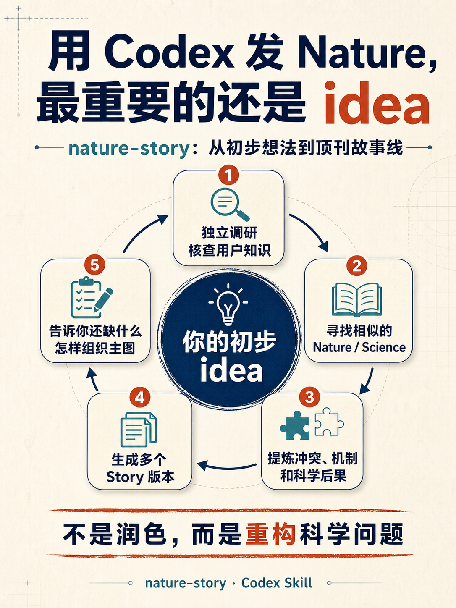
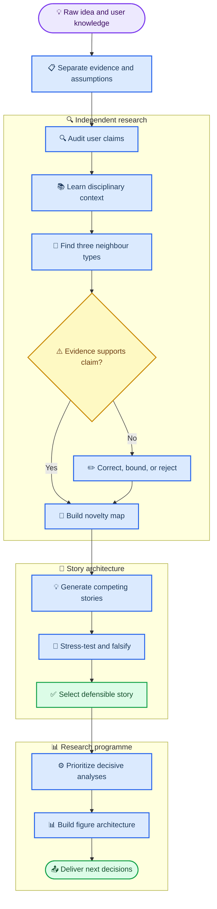

# nature-story

_Evidence-grounded scientific story architecture for engineering and coupled human–environment research_

[English](#-english) · [中文](#-中文)



---

## 🌐 English

### What this skill does

`nature-story` turns an early research idea into several testable, evidence-grounded scientific story architectures. It is designed for atmospheric science, air pollution, energy, cities, infrastructure, human behaviour, economics, inequality, development, and policy.

It works upstream of manuscript polishing. Instead of making an ordinary project sound impressive, it asks whether the scientific question, mechanism, evidence, and consequence can be made genuinely stronger.

> **Core rule:** Do not make an idea more important through language. Make it more important by changing the scientific question—and only when evidence can support that change.

### Why it is different

| Advantage | What it changes |
| --- | --- |
| **Research-first** | Searches topic, mechanism, and narrative neighbours before proposing a story |
| **Epistemically independent** | Treats user-provided knowledge as claims to verify, not instructions to repeat |
| **Domain-aware** | Learns the field's mechanisms, definitions, evidence standards, and decision context |
| **Multiple competing stories** | Produces conservative, mechanism-first, consequence-first, and high-upside versions |
| **Analysis-generating** | Identifies decisive tests, missing evidence, falsification checks, and analyses to delete |
| **Claim-calibrated** | Separates descriptive, associational, causal, mechanistic, projective, and normative claims |
| **Figure-driven** | Builds a paper around belief-changing figures rather than a chronology of available outputs |
| **Results-ready** | Ends with four or five claim-led Results section titles mapped to evidence and figures |

### Workflow



### Installation

Install from GitHub:

```text
Use the skill installer to install https://github.com/haohuresearch/nature-story
```

Or copy this repository to `~/.codex/skills/nature-story`.

### Prompt commands

Standard idea uplift:

```text
Use $nature-story. I have city-level ozone, temperature, demographics, and policy data. Find the closest high-impact papers and propose several stronger but testable stories, missing analyses, and a figure architecture.
```

Independent knowledge audit:

```text
Use $nature-story in knowledge-audit mode. Treat everything I provide as provisional. Independently research the field, verify my definitions and mechanisms, identify claims that are wrong or oversimplified, and only then construct competing storylines.
```

Deep disciplinary learning:

```text
Use $nature-story. Before designing the story, learn the relevant disciplinary context: canonical mechanisms, competing explanations, accepted evidence standards, key measurements, policy constraints, and recent Nature/Science-family literature. Show where my framing conflicts with that evidence.
```

Audit an existing paper plan:

```text
Use $nature-story to audit this outline. Identify the current contribution level, weakest scientific link, unsupported claims, missing killer analysis, redundant analyses, and three alternative story architectures.
```

### Outputs

- Verified near-neighbour literature matrix
- User-knowledge audit with supported, disputed, and unresolved claims
- Evidence and assumption ledger
- Multiple competing story versions
- Story stress test and fatal weaknesses
- Essential, enhancing, optional, and removable analyses
- Claim–evidence matrix and falsification plan
- Figure-driven paper architecture
- Four- or five-section Results title architecture for the recommended story
- Recommended next analysis with the highest information gain

### Limits

The skill cannot guarantee a journal, manufacture novelty, or replace domain modelling, causal inference, statistical review, or expert judgement. When literature access is incomplete or evidence conflicts, it must report the limitation and narrow the story.

## 📚 中文

### 这个 Skill 做什么

`nature-story` 将初步研究想法提升为多个可检验、以证据为基础的科学故事架构。它面向大气科学、空气污染、能源、城市、基础设施、人类行为、经济、不平等、发展与政策等工程和人地耦合研究。

它工作在论文润色的上游。目标不是把普通项目包装得更宏大，而是判断科学问题、机制、证据链和后果能否被真正提升。

> **核心原则：** 不要通过语言让一个想法显得更重要；应当改变科学问题本身，并且只在证据能够支持时进行升级。

### 核心优势

| 优势 | 它带来的改变 |
| --- | --- |
| **先研究再构建故事** | 先检索主题近邻、机制近邻和叙事近邻，再提出故事 |
| **保持认知独立** | 把用户提供的知识视为待核查主张，而不是必须复述的事实 |
| **尊重学科特征** | 主动学习学科机制、定义、证据标准与决策环境 |
| **多个竞争版本** | 同时生成保守版、机制版、后果版和高收益高风险版 |
| **推动新增分析** | 找出决定性检验、缺失证据、证伪测试和可删除分析 |
| **校准主张强度** | 区分描述、关联、因果、机制、预测与规范性主张 |
| **以图推进故事** | 让每张主图改变读者认知，而不是简单堆叠已有结果 |
| **直接形成 Results 骨架** | 最终给出 4–5 个由证据和主图支撑、逐步推进论证的结果章节标题 |

### 工作流程

上方流程图展示了完整路径：原始想法首先被拆分和独立核查；Codex 随后学习学科背景、检索三类近邻文献、纠正或限定错误主张，最后才生成和筛选故事，并将其转化为分析计划与主图架构。

### 安装

从 GitHub 安装：

```text
使用 skill-installer 安装 https://github.com/haohuresearch/nature-story
```

也可以将仓库复制到 `~/.codex/skills/nature-story`。

### 推荐命令

普通 idea 提升：

```text
使用 $nature-story。我有城市臭氧、气温、人口特征和政策数据。请先寻找最相近的高影响力论文，再提出多个更强但可检验的故事版本、缺失分析和主图架构。
```

独立知识核查：

```text
使用 $nature-story 的 knowledge-audit 模式。把我提供的所有内容都视为暂定信息。请独立调研该学科，核查我的定义、机制和判断，指出错误、过度简化与证据冲突，然后再构建多个故事版本。
```

深度学习学科背景：

```text
使用 $nature-story。在设计故事之前，先学习相关学科背景，包括经典机制、竞争性解释、公认的证据标准、关键测量方法、政策约束和近期 Nature/Science 及子刊论文，并明确指出我的框架与现有证据冲突之处。
```

审核已有论文方案：

```text
使用 $nature-story 审核这个论文框架。判断当前贡献层级、最薄弱的科学环节、无证据支持的主张、缺失的 killer analysis、冗余分析，并给出三个替代故事架构。
```

### 输出内容

- 经过核实的近邻文献矩阵
- 用户知识核查表：支持、争议、错误与尚未解决的主张
- 证据、推断和假设分类账
- 多个相互竞争的故事版本
- 故事压力测试与致命薄弱点
- 必需、增强、可选和应删除的分析
- 主张—证据矩阵与证伪计划
- 图驱动论文架构
- 推荐故事对应的 4–5 个 Results 章节标题及其证据、主图映射
- 信息增益最高的下一项分析

### 使用边界

该 Skill 不能保证投稿期刊，不能制造创新性，也不能代替领域建模、因果推断、统计审查和专家判断。如果文献访问不完整或证据相互冲突，它必须报告限制并主动收窄故事。

## 🔗 Repository guide

- [Skill instructions](SKILL.md)
- [Literature workflow](references/literature-workflow.md)
- [Knowledge validation](references/knowledge-validation.md)
- [Story archetypes](references/story-archetypes.md)
- [Domain lenses](references/domain-lenses.md)
- [Output contract](references/output-contract.md)
