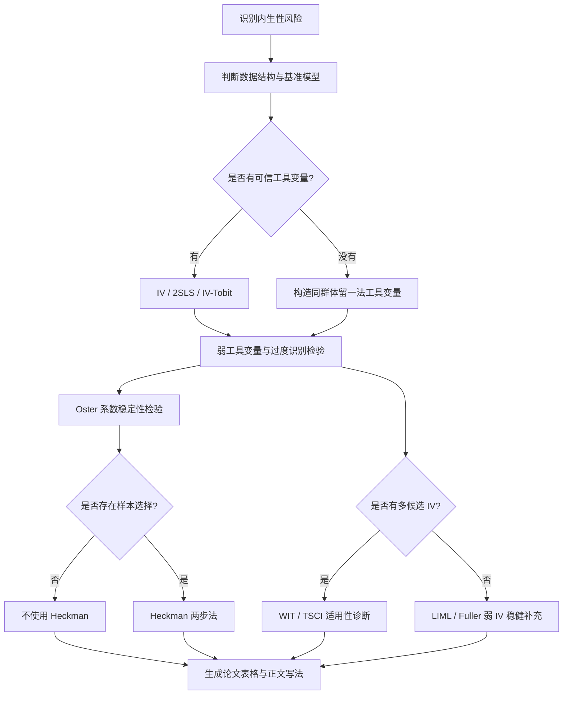

# neishengxing 🧭

<p align="center">
  
</p>

<p align="center">
  
  
  
  
  
</p>

> 📌 一个面向**经济学实证论文内生性处理章节**的 Codex Skill。  
> 它不是“把结果洗显著”的魔法盒，而是帮助研究者判断：**哪种内生性问题存在、哪种方法能用、哪些检验必须汇报、哪些说法不能过度承诺。**

---

## 🌟 这个 Skill 解决什么？

很多实证论文都会卡在同一个地方：主回归有了，机制和稳健性也有了，但审稿人仍然会问：

- “有没有遗漏变量？”
- “有没有反向因果？”
- “工具变量强不强？”
- “过度识别检验做了吗？”
- “Heckman 到底适不适用？”
- “Oster、WIT、TSCI 这些方法能不能作为补充？”
- “因变量是 0—1 的比例变量，OLS 还能不能作为主模型？”

`neishengxing` 的目标是把这些问题整理成一套**可诊断、可运行、可汇报、可写进论文**的工作流。

---

## 🔄 工作流一览



---

## 🧰 方法速查表

| 方法 | 代表文献 | 主要解决什么 | 基本做法 | 不能解决什么 |
|---|---|---|---|---|
| **工具变量法 IV / 2SLS** | Sargan (1958); Hansen (1982) | 解释变量与误差项相关，如遗漏变量、反向因果、测量误差 | 找到只影响核心解释变量、不直接影响因变量的外生变量，分两阶段估计 | 不能自动保证工具变量外生；弱工具变量会导致估计偏误 |
| **IV-Tobit** | Tobin (1958) + IV 思路 | 因变量是被截断/受限变量，且核心解释变量可能内生 | 在 Tobit 框架下引入工具变量或控制函数，适合 0—1 比例类因变量 | 不能替代工具变量外生性论证；诊断和解释成本更高 |
| **同群体留一法 IV** | peer-exposure 思路，需结合具体文献 | 没有外部工具变量时，构造可直接运行的“同村/同县/同市其他人均值”工具变量 | 对每个个体计算同群体中“除自己外其他个体”的核心解释变量均值 | 容易受到共同冲击、同伴溢出、地区排序影响；需要谨慎写作 |
| **弱工具变量检验** | Bound et al. (1995); Staiger and Stock (1997); Kleibergen and Paap (2006) | 判断工具变量是否太弱 | 汇报第一阶段 F、KP rk Wald F、AR、Stock-Wright、CLR 等 | 不能证明排除限制成立，只能检验相关性和弱识别风险 |
| **过度识别检验** | Sargan (1958); Hansen (1982) | 一个内生变量对应多个工具变量时，检验工具变量整体排除限制 | 汇报 Sargan 或 Hansen J 检验 p 值 | 检验通过不等于工具变量一定外生；检验力可能不足 |
| **Oster (2019)** | Oster (2019) | 评估遗漏变量是否可能推翻主结果 | 比较短回归与完整控制回归的系数和 R²，计算调整后系数或识别区间 | 主要适合 OLS 系数稳定性；不能替代 IV，也不能直接替代 Tobit |
| **Heckman 两步法** | Heckman (1979) | 样本选择偏误，例如工资只对就业者可见 | 第一步估计进入样本/被观测概率，第二步加入逆米尔斯比率修正结果方程 | 不能处理“真实 0”；如果没有清晰选择方程，不应硬用 |
| **WIT / many-IV** | Lin et al. (2024) | 多个候选工具变量中可能同时存在弱 IV 和无效 IV | 构造候选 IV 池，筛选或加权相对有效的工具变量，并报告有效 IV 池 | 不适合几个手工挑选的小 IV 集合；不能省略候选池来源说明 |
| **TSCI / STCI** | Carl et al. (2025) | 在存在无效工具变量时，利用结构性非线性/曲率信息识别因果效应 | 检查方法适用性后，用 R 包估计并报告曲率/有效性诊断 | 不是简单“把几个弱 IV 合成强 IV”；数据不满足诊断时不能硬写 |
| **LIML / Fuller-LIML** | Staiger and Stock (1997) 等 | 弱 IV 情况下，作为 2SLS 的稳健对照 | 比较 2SLS、LIML、Fuller-LIML 的方向和量级 | 不能修复无效工具变量；只是弱 IV 下的小样本稳健补充 |

---

## 📚 核心文献与 DOI

这个 Skill 内置了一个方法文献索引：[references/literature.md](references/literature.md)。

常用来源包括：

- Tobin (1958), limited dependent variables: `10.2307/1907382`
- Sargan (1958), instrumental variables and overidentification: `10.2307/1907619`
- Hansen (1982), GMM and Hansen J: `10.2307/1912775`
- Heckman (1979), sample selection: `10.2307/1912352`
- Bound et al. (1995), weak instruments: `10.1080/01621459.1995.10476536`
- Staiger and Stock (1997), weak IV: `10.2307/2171753`
- Stock and Wright (2000), weak identification robust GMM: `10.1111/1468-0262.00151`
- Kleibergen and Paap (2006), robust rank and weak-IV tests: `10.1016/j.jeconom.2005.02.011`
- Oster (2019), coefficient stability: `10.1080/07350015.2016.1227711`
- Lin et al. (2024), WIT / many weak and invalid IVs: `10.1093/jrsssb/qkae025`
- Carl et al. (2025), TSCI: `10.18637/jss.v114.i07`

---

## 🗂️ 仓库结构

```text
neishengxing/
├── SKILL.md
├── README.md
├── LICENSE
├── .gitignore
├── agents/
│   └── openai.yaml
├── references/
│   ├── literature.md
│   ├── method_cards.md
│   └── reporting_templates.md
└── scripts/
    └── build_leave_one_out_iv.py
```

---

## 🧪 内置脚本：同群体留一法工具变量

当没有现成外部工具变量时，可以构造“同村/同县/同市除本户外其他人的均值”作为候选工具变量。

```bash
python scripts/build_leave_one_out_iv.py data.csv \
  --group village_id \
  --vars pd digital_index \
  --out loo_iv.csv
```

它会生成：

```text
loo_pd
loo_digital_index
```

公式为：

```text
loo_x_i = (同组 x 总和 - 本户 x_i) / (同组非缺失样本数 - 1)
```

⚠️ 注意：这个工具变量是“可构造的备选方案”，不是天然完美工具变量。正式论文中必须解释为什么同群体数字环境影响个体参与，但不直接影响被解释变量，并尽量控制地区固定效应、村级控制和家庭特征。

---

## ✅ 推荐输出格式

一次好的 `neishengxing` 调用，通常应该产出：

- **诊断结论**：内生性风险来自哪里，哪些方法适用，哪些不适用。
- **可运行代码**：Stata / R / Python 命令，最好带中文注释。
- **结果表格**：第一阶段、第二阶段、弱 IV、过度识别、Oster、WIT/TSCI 等必要汇报。
- **论文写法**：可以直接放进正文或附录的保守表述。
- **风险边界**：哪些结果只能作为补充，哪些不能写成因果识别主证据。

---

## 🚫 这个 Skill 不做什么？

`neishengxing` 不会：

- 编造工具变量；
- 把弱 IV 说成强 IV；
- 把不适用的 Heckman 硬塞进论文；
- 把 WIT/TSCI 当作“高级包装”乱用；
- 隐藏失败诊断；
- 用显著性替代识别可信度；
- 把“稳健性补充”写成“彻底解决内生性”。

---

## 🎯 适合谁用？

这个 skill 特别适合：

- 正在写实证论文内生性章节的研究者；
- Stata-first 的经济学论文项目；
- 需要快速判断 IV / Oster / Heckman / WIT / TSCI 是否适用的作者；
- 正在处理审稿人关于内生性、弱工具变量、样本选择质疑的修稿任务；
- 需要把“跑过的检验”整理成论文正文和表格的 Codex 用户。

---

## 🏷️ Suggested GitHub About

**Description**  
经济学实证论文内生性处理工具箱：IV、IV-Tobit、Oster、Heckman、WIT、TSCI 与同群体留一法工具变量。

**Website**  
可以暂时留空。

**Topics**  
`codex-skill`, `economics`, `empirical-economics`, `endogeneity`, `instrumental-variables`, `weak-iv`, `oster`, `heckman`, `tobit`, `stata`, `rstats`, `research-workflow`

---

## 📄 License

MIT
