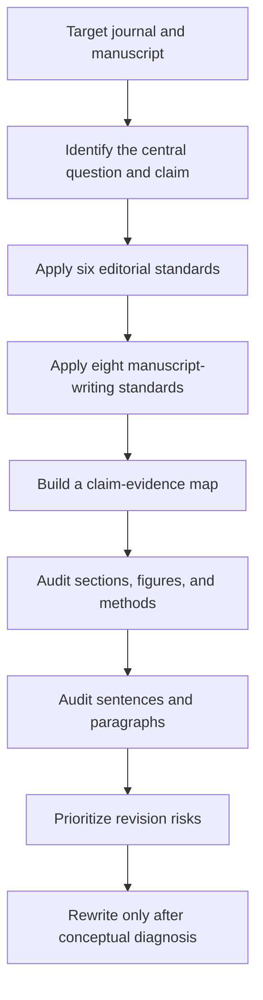
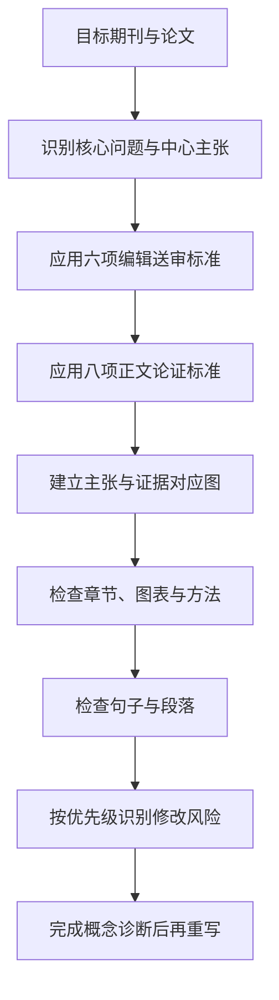

# Top-Journal Manuscript Review Skill

[English](#english) | [中文](#中文)

## English

### Overview

`top-journal-manuscript-review` is a Codex skill for auditing, restructuring, and rewriting research manuscripts intended for leading multidisciplinary and field-specific journals.

The skill evaluates a manuscript before polishing its language. It asks whether the research question is important, whether the conceptual contribution is clear, whether the evidence supports the claims, and whether the full manuscript tells one coherent story.

It is designed for journals such as *Nature*, *Science*, *Cell*, *PNAS*, *Nature Human Behaviour*, *Management Science*, *Information Systems Research*, and comparable journals.

### Core framework

The skill operates at three levels:

1. **Six editorial standards** determine whether a manuscript is likely to pass editorial screening.
2. **Eight manuscript-writing standards** determine whether the argument is coherent and adequately supported.
3. **Sentence-level auditing** prevents proxies, constructs, evidence levels, and causal meanings from drifting during writing.



### Six editorial standards

- Problem importance
- Conceptual advance
- Claim-evidence match
- Identification and methodological rigour
- Broad significance with explicit boundaries
- Narrative discipline

### Eight manuscript-writing standards

- One central proposition
- One argumentative function per section and figure
- Claims equal evidence
- Hierarchical reporting of results
- Methods mapped to conclusions
- Discussion adds concepts rather than repeating results
- Authority through restraint and clarity
- Reader-centred sentence and paragraph discipline

### Supported tasks

Use this skill to:

- assess desk-rejection and external-review risks;
- review a complete manuscript as an editor or skeptical reviewer;
- align the title, abstract, introduction, results, methods, discussion, supplement, and cover letter;
- identify causal overstatement, proxy confusion, hidden assumptions, and construct drift;
- restructure figures and sections around a single contribution;
- rewrite individual sections after the conceptual problems are diagnosed.

### Repository structure

```text
top-journal-manuscript-review/
├── SKILL.md
├── README.md
├── agents/
│   └── openai.yaml
└── references/
    ├── editorial-standards.md
    └── manuscript-writing.md
```

### Installation

Place the repository in your Codex skills directory:

```text
~/.codex/skills/top-journal-manuscript-review/
```

On Windows, the default location is typically:

```text
C:\Users\YOUR_USERNAME\.codex\skills\top-journal-manuscript-review\
```

Restart or refresh Codex after installation if the skill is not immediately discovered.

### Usage

Invoke the skill explicitly:

```text
$top-journal-manuscript-review
```

Example request:

```text
Use $top-journal-manuscript-review to assess whether this manuscript is ready for external review at Nature Human Behaviour. Identify the major desk-rejection risks before rewriting any text.
```

### Review outputs

Depending on the request, the skill can return:

- an editorial verdict;
- prioritized major findings;
- a claim-evidence risk audit;
- a figure-to-claim evidence map;
- a revised manuscript architecture;
- section-level rewrites;
- residual risks that writing changes alone cannot resolve.

### Scope and limitations

This skill improves editorial reasoning, evidentiary alignment, manuscript structure, and prose. It does not guarantee publication and must not be used to invent evidence, mechanisms, citations, novelty, or journal fit. Final scientific judgments remain the responsibility of the authors.

---

## 中文

### 项目简介

`top-journal-manuscript-review`是一套用于顶级综合期刊和领域顶刊论文审查、重构与修改的Codex Skill。

该Skill不会直接从语言润色开始，而是首先判断研究问题是否重要、概念贡献是否清晰、证据是否支持主张，以及标题、摘要、正文、图表、方法和讨论是否共同服务于同一个中心命题。

适用期刊包括 *Nature*、*Science*、*Cell*、*PNAS*、*Nature Human Behaviour*、*Management Science*、*Information Systems Research*及其他同等级期刊。

### 核心框架

Skill分为三个层次：

1. **六项编辑送审标准**：判断论文能否通过编辑初筛并进入外审。
2. **八项正文论证标准**：判断全文结构、证据链和叙事是否成立。
3. **句子与段落审计**：防止代理指标、概念、证据等级和因果含义在写作中发生漂移。



### 六项编辑送审标准

- 问题高度与重要性
- 概念增量
- 主张与证据匹配
- 识别策略与方法严谨性
- 广泛意义及其边界
- 全文叙事纪律

### 八项正文论证标准

- 全文只有一个中心命题
- 每个章节和图表只承担一个论证功能
- 主张强度严格等于证据强度
- 结果按照模式、效应量和稳健性分层报告
- 方法与结论一一对应
- Discussion提升概念而不重复Results
- 通过克制和清晰建立权威感
- 以读者为中心进行句子和段落控制

### 适用任务

该Skill可以用于：

- 判断论文面临的拒稿和送审风险；
- 以编辑和严格审稿人的视角审阅完整论文；
- 统一标题、摘要、导论、结果、方法、Discussion、附录和Cover letter；
- 识别因果越界、代理指标混淆、隐藏假设和概念漂移；
- 围绕一个中心贡献重构正文和图表；
- 在完成概念诊断后重写具体章节。

### 文件结构

```text
top-journal-manuscript-review/
├── SKILL.md                         # Skill入口与执行流程
├── README.md                        # 中英文项目说明
├── agents/
│   └── openai.yaml                  # Codex界面与默认提示配置
└── references/
    ├── editorial-standards.md       # 六项编辑送审标准
    └── manuscript-writing.md        # 八项正文与微观写作标准
```

### 安装方法

将整个仓库放入Codex个人Skills目录：

```text
~/.codex/skills/top-journal-manuscript-review/
```

Windows的默认位置通常为：

```text
C:\Users\你的用户名\.codex\skills\top-journal-manuscript-review\
```

如果安装后没有立即显示，可以重新启动或刷新Codex。

### 使用方法

在任务中直接调用：

```text
$top-journal-manuscript-review
```

示例：

```text
使用 $top-journal-manuscript-review 判断这篇论文是否达到Nature Human Behaviour的外审标准。在修改文字之前，先按严重程度指出可能导致编辑拒稿的问题。
```

### 输出内容

根据任务类型，Skill可以输出：

- 编辑送审判断；
- 按严重程度排列的主要问题；
- 主张与证据风险审计；
- 图表与核心结论对应关系；
- 全文结构重组方案；
- 具体章节的重写版本；
- 单纯依靠写作修改无法解决的剩余风险。

### 使用边界

该Skill用于改善编辑判断、证据匹配、论文结构和语言表达，但不能保证论文被接收，也不能用于虚构证据、机制、参考文献、创新性或期刊契合度。最终科学判断和投稿责任仍由作者承担。
